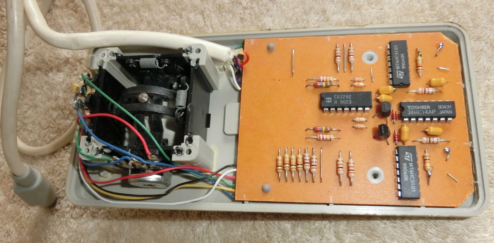
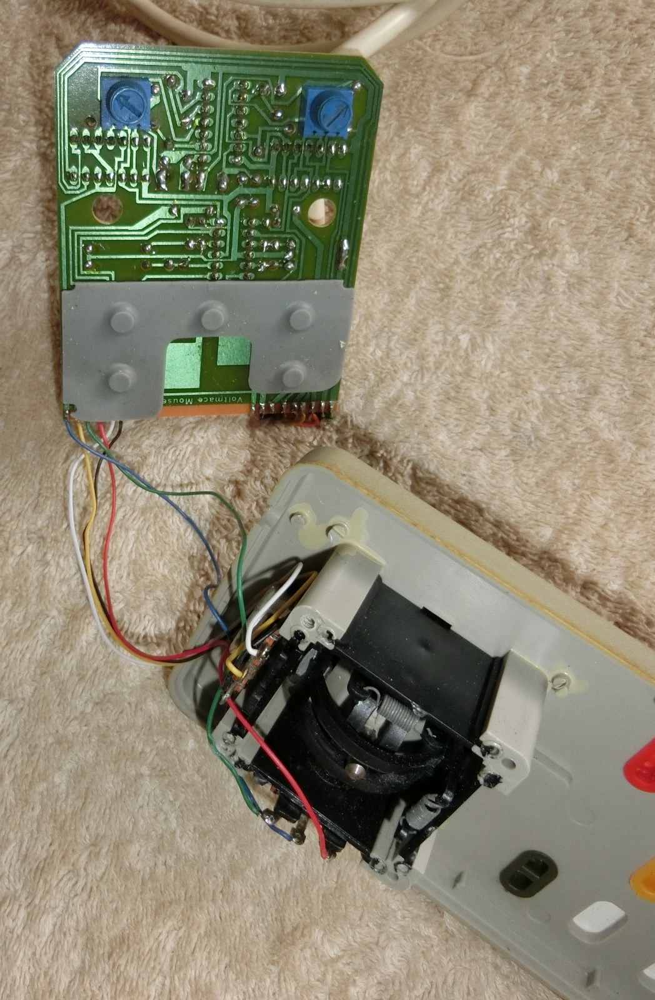
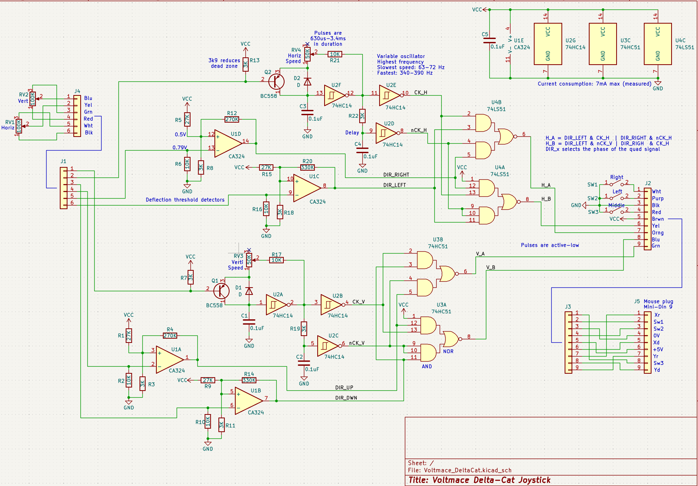

# Voltmace Delta-Cat Joystick Mouse Eliminator

This project documents the internals and functioning of this vintage Joystick for Acorn Archimedes computers.

Unlike earlier BBC micros, many of the Archimedes range did not include an analog port, so Voltmace came up with this solution, which plugs into the mouse port. It was a popular option for controlling FPV games, like Zarch, Chocks Away and Elite.

The back is held on with four screws, two shorter than the others. The top and bottom of the case form a clamp around the cable, so it takes a little effort to pull the back off.

Inside are the X/Y pots and a printed circuit board with (amongst other things) a quad OpAmp chip, 3 logic ICs and 2 PCB mounted pots used for controlling the vertial and horizontal speed.

The buttons are rubber membrane and pop off quite easily.

The circuit diagram is as follows:

The design is quite interesting. A positive voltage is supplied to the center of the X/Y poentiometers (via fixed resistors R7/R13) and each end of the pots are connected to ground via more resistors (R2/R6/R10/R16). The supply and ground resistors develop a small voltage across them but not enough to activate the rest of the circuit.

As the stick is moved in one direction, the drop in resistance across one side of the pot raises the voltage across some of these fixed resistors. The effects are two-fold:

1. The rise in potential across the ground resistor triggers a threshold detector (implemented by an OpAmp), indicating the direction of movement.
2. The rise in potential across the supply resistor activates a variable frequency oscillator (via transistor), that is otherwise idle. The greater the potential, the higher the frequency. The speed pots (RV3/RV4) affect the frequency range of the two oscillators.

The dead zone can be altered by adjusting R7/R13, increasing the value reduces the dead zone but beware that years of gaming introduces some play in the joystick column.

The output of the oscillator (U2A/U2F) goes into a delay gate (U2C/U2D), effectively producing the out-of-phase signal used for quadrature outputs. Both phase signals are then fed into a logic block (U3/U4) that passes them through unaltered if input is detected in one direction, or passes them reversed if input is detected in the opposite direction. The normally-high, low-going pulses are sent to the computer via the mouse port.

The PCB included in this project was intended to verify the circuit, by comparing it to the original. It is quite accurate dimensionally but the position of the speed pots might be off slightly and there are no pads for the rubber membrane keys (I have placed momenary switches instead). If you want to manufacture a PCB from this design, it will probably require a bit of tweaking. Using a modern microcontroller will probably be cheaper and the frequencies documented in the schematic should help.
